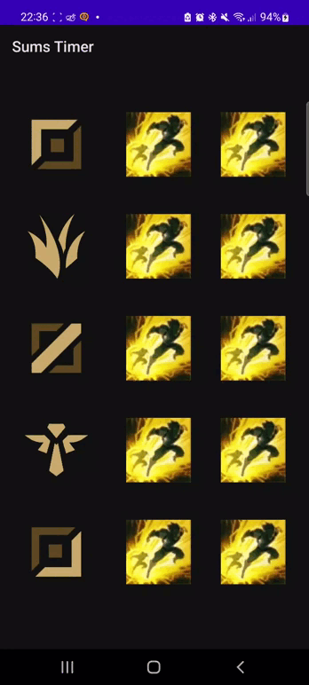

#  <u>SumsTimer</u>
Personal project allowing one to easily keep track of opponents' summoner spells cooldowns on the PC game League Of Legends.

Made in java android on Android Studio. (Android 10+)

On launch, every summoner spell is on flash by default. Change the summoner spells by long clicking on it and selecting the actual spell of the corresponding opponent in your game.

---
## Demo:
  

---
 

## 
GLHF!
